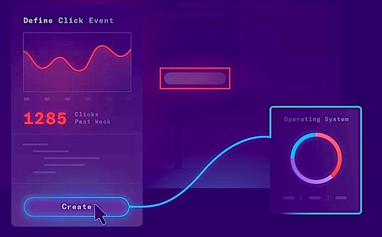
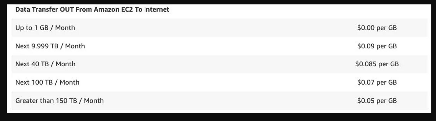

We have been recently seeing a surge in open-source alternatives to existing
products or to be precise open-source SaaS platforms

In 2020–21 alone a lot of open-source platforms came out of nowhere.
The famous startup accelerator from silicon valley Y-Combinator unveiled
its list of companies, many of which were open-source community-powered products.
YC already has two big open-source companies **GitLab**(open-source GitHub) &
**Mattermost**(open-source slack).

Most of the new open-source SaaS products are coming from India. This is not surprising as it's home to open-source products like Postman. Now, New products with a huge number of GitHub stars & communities are coming out like:

1. Chatwoot : Open-source customer engagement suite (Zendesk & Intercom alternatives)
2. Fusion : open-source product analytics (mixpanel, amplitude, hotjar)
3. Supabase : Open-source firebase alternative
4. Signoz : Open-source fullstack observability platform (Datadog & NewRelic)
5. SuperToken : Auth & user management (auth0)
6. Appsmith : open source internal-tool (retool)
7. ToolJet : open source no-code internal-tool (retool)
8. Firecamp : open-source multi-type API platform

But why do we really need open-source products, we understand the community support for building and fixing products but what else?

**Pranay Prateek**, CEO of SigNoz highlighted some of these reasons in his [blog](https://signoz.io/blog/self-hosting-software-observability/)

There are multiple reasons :

1. Increase in privacy laws like GDPR/CPRA
2. The flexibility of configuration as you are not crossing internet boundaries every-time
3. Data egress cost
4. Data breaches
5. More control
6. Not just an alternative

Let us examine few of these in more detail

- **Privacy Laws** — The General Data Protection Regulation (GDPR) went into effect in May 2018, and it has been a critical step in protecting people's fundamental rights in the present Digital Revolution, as well as preventing firms from exploiting data for financial benefit, putting users at risk.

  Another privacy regulation, the California Privacy Regulation Act (CPRA), would enforce stricter privacy rules for sharing user data with third-party businesses.Users will be able to opt-out of having their data shared with third-party vendors starting in 2023. ( including vendors like DataDog, Google Analytics, etc.). You must sanitize your user data before sending it to a third-party SaaS solution if you are using one.

  How will you debug a critical issue when management is breathing down your neck to fix it — like yesterday — because you won’t have complete visibility into what’s going on in your software infrastructure now?

- **Data breaches** — Hacking a single SaaS vendor will give hackers access to critical data from many companies, making cloud vendors a honeypot for security breaches. You have no idea if your data has been compromised because hackers hacked a SaaS provider in order to gain access to one of their customers. There is frequently no obvious separation of data from multiple companies.

  If you use 100 SaaS vendors, each of which has a 0.5 percent probability of experiencing a security breach, you have a 1 — (0.995)100 = 40% chance of experiencing a security breach.

  Are all of your SaaS providers similarly secure?

- **Data egress cost** — Many technical teams are unaware of this because it is merely a line item on your AWS/GCP bill that few people pay attention to. However, if you’re sending a lot of monitoring/logging data to a SaaS vendor, this line item will appear sooner or later

  AWS charges are payable at region-specific and tiered data transfer rates for transfers that transmit data out across the internet. If you send 10 TB to the Internet each month, your monthly cost will increase by 900 USD.

  Pricing for AWS data transfer

  

  **Grant Miller**, the CEO of **Replicated**, published an intriguing [blog](https://techcrunch.com/2018/06/17/after-twenty-years-of-salesforce-what-marc-benioff-got-right-and-wrong-about-the-cloud/) on why the modern on-prem delivery paradigm is far superior to SaaS in terms of software delivery.

  When you think about it, SaaS was a refreshing change from the early 2000s’ world of legacy on-prem software deployment. To get started with your software, you’d need to purchase expensive hardware, annual licenses, and then hire consultants to get it up and running. The entire process might easily take 3–6 months if everything goes according to plan. Then there would be an annual ritual of upgrading the software which would be another pain in the a\*\*\*.

  SaaS was, understandably, a welcome shift in this world.

  However, with the introduction of new cloud-native technologies such as Kubernetes, this procedure has gotten significantly easier. Today, you may install the software simply by running a command.

_Kubectl deploy_

To upgrade the software, all you have to do is update the Helm charts and re-deploy. And, given the benefits of privacy, security, and increased control discussed above, why not give it some serious thought?

If you need more social proof to give more thought to this, here’s Elon Musk tweeting about how Tesla **ONLY** uses _“internal & open source software”_

Tesla is using only internal & open source software & operates Bitcoin nodes directly.

Bitcoin paid to Tesla will be retained as Bitcoin, not converted to fiat currency. — Elon Musk (@elonmusk) March 24, 2021

- **Not just an alternative** — Most of these tools, although they say they are alternatives, are not exactly the same but have something unique.
  1. Signoz — Is a full-stack solution for trace, logs & metrics with a really good UI.
  2. Fusion — has visual analytics features like hotjar & marketing engagement suite with traditional analytics
  3. Chatwoot — Focuses on multi-channel communication.

Giving them an edge over other open-source alternatives

If you like this blog, check out [Fusion](https://fusionhq.co/) , which is an open-source, self-hosted product analytics platform — alternative to Mixpanel, Amplitude & Hotjar.

We welcome any kind of open-source contribution. Come join us to build the future of product analytics!

Check out Fusion’s [Github](https://github.com/fusion-hq/fusion) repo here
