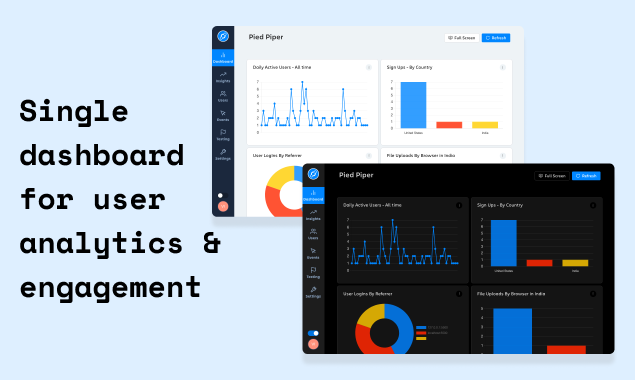

Before I get started let me share what we are building right now

[Fusion]("https://fusionhq.co") is an open-source lightweight user behavior analytics and engagement platform.

It's built upon a simplified low-code Mixpanel like analytics engine with built-in live-chat, push-notification, and email/micro-surveys.

Fusion shows how your users interact with your web-based products eg: page-views, button clicks, form submissions, etc. But apart from this, Fusion lets you engage with a specific user or group of the user who have something in common or performed a particular action, in real-time with live-chat, in-app push notification, send targeted email/micro-surveys or set it up to trigger automatically.

Now,

✍️ Story

I applied to YC-W21 just with an idea during my last sem of engineering. We were building a firebase-like cloud for companies building smart IoT devices. Next 2 months we built a minimal prototype and luckily got an interview invite as well. After rejection from YC interviews and the email feedback, It was very clear that this was not something we wanted to do. Although YC rejection was positive they liked our idea, product, and progress so far but we did not have any users just an LOI so they wanted us to apply again next batch with some users.

Although we scrapped our previous project for several reasons(will cover it in a future post.) After working on another idea and talking to our user for a couple of months we started to work on a simplified open-source alternative to Mixpanel/Amplitude for startups as these platforms were a bit bloated/ required a complicated setup and we could only find a session based simplified analytics alternatives like plausible & simple analytics which are like google analytics.

After some trials, it was obvious that our early customers who were also startups did not want to use another SAAS platform because they were already dealing with things like intercom, MailChimp, google-analytics, etc. These tools have too many features as they are separate stand-alone platforms small teams end up spending a lot of time and money. On the other hand integration between all these platforms are crappy and third-party customer data platforms like segment are expensive and overkill. We use & love crisp.chat not just because of how simple it is but also how it focuses on important features only and still gives a unified experience.

Inspired by all these, we decided to build a lightweight all-in-one solution helping startups understand, engage, convert and retain users from single app.

🚀 Progress
We launched our polished MVP on [product hunt](https://www.producthunt.com/posts/fusion-4) and open-sourced our codebase for community. We are accepting beta request and helping users to try fusion locally. Feel free to connect with us if interested to try Fusion or want to contribute to open-source.

Thanks for your time,
Cheers ✌️
